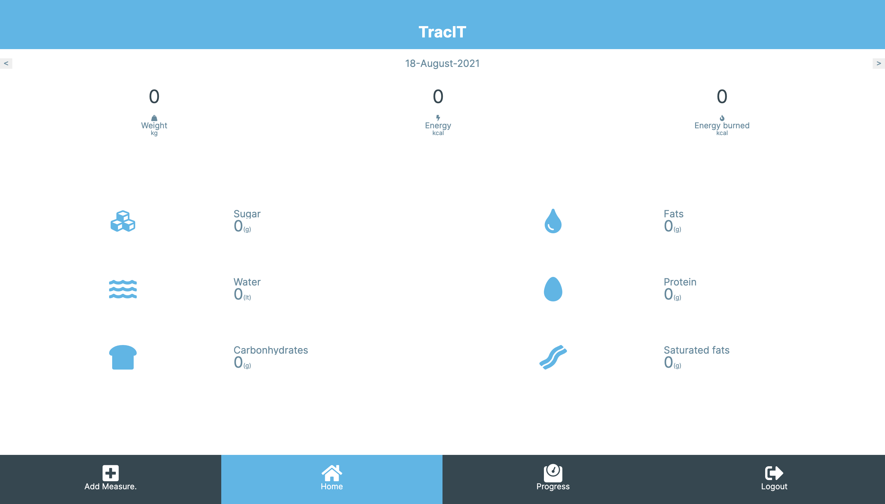

# Trac.IT


## Description

This is a mobile tracking app for measuring weight and the nutritional intakes. Individuals can create an account and when logged, can add their measurements and preview the amount of the basic nutrients or total amount of energy consumed and burned. This application  is connected to a REST API built with Ruby on Rails. The design of the project is inspired by [Gregoire Vella on Behance](https://www.behance.net/gregoirevella) and can be found [here](https://www.behance.net/gallery/13271423/Bodytrackit-An-iOs-app-Branding-UX-and-UI). The base url of the backend API can be found [here](https://fast-escarpment-85327.herokuapp.com).


## Library Directory 📙

| Contents                    |
| --------------------------- |

| [Live Demo](#live-demo)     |
| [Screenshot](#screenshot)   |
| [Built With](#built-with-🛠) |
| [Getting Started](#getting-started-🛠) |
| [Contributing](#contributing🛠) |
| [Authors](#authors)         |
| [License](#license)         |

## Live Demo

[Trac.IT](https://john-tracker.herokuapp.com/)


 ## Screenshot



## Built With 🛠

```
- React.js
- Redux
- SCSS

```

## Getting Started


- `git clone git@github.com:udberg/health-tracker.git`
- `cd health-tracker`
- `npm install`
- `npm run start`

To run the tests: 
- `npm test`


## Contributing

- Fork the project
- Create your feature branch `git checkout -b awesome-feature`
- Commit your changes `git commit -m 'Awesome feature'`
- Push it `git push -u origin awesome-feature`
- Open a pull request using this branch

## Authors

### 👨‍💻 Uduak John

[](https://github.com/udberg) <br>
[](https://www.linkedin.com/in/juduak/) <br>
[](mailto:udberg@icloud.com) <br>
[](https://twitter.com/juduak_)

### 🤝 Contributing

Contributions, issues and feature requests are welcome!

Feel free to check the [issues page](https://github.com/udberg/health-tracker/issues).

### Show your support

Give a ⭐️ if you like this project!

### License


